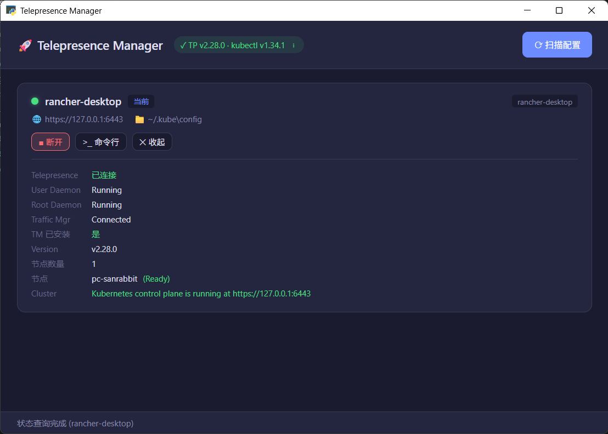

# Telepresence Manager

A Windows desktop GUI tool for managing [Telepresence](https://www.telepresence.io/) connections. Built with Python + pywebview (Edge WebView2).

[中文文档](README.zh.md)

## Features

- 🔍 Auto-scan `~/.kube/` for K8s config files (config, *.txt, *.yaml, etc.)
- 📋 Display all contexts as card list (name, cluster, server, source file)
- ▶️ One-click connect / disconnect Telepresence
- 📊 On-demand status check (connection state, node count, Traffic Manager status)
- 📦 Install / upgrade Traffic Manager
- 💻 Open command prompt with selected context
- 🔧 Auto-detect telepresence & kubectl installation, show version and path

## Screenshot



## Prerequisites

- Windows 10/11
- [telepresence](https://www.telepresence.io/) v2.x
- [kubectl](https://kubernetes.io/docs/tasks/tools/)
- Edge WebView2 Runtime (built-in on Windows 10/11)

## Installation

### Download (Recommended)

Download the latest release from [GitHub Releases](https://github.com/hueidou/telepresence-manager/releases):

| Artifact | Description |
|----------|-------------|
| `TelepresenceManager.exe` | Standalone executable — double-click to run |
| `TelepresenceManager-*-portable.zip` | Portable package — extract and run |
| `TelepresenceManager-*-Setup.exe` | Windows installer — install with Start Menu shortcut |

### From Source

```bash
git clone https://github.com/hueidou/telepresence-manager.git
cd telepresence-manager
pip install -r requirements.txt
python main.py
```

### Build Locally

```bash
pip install pyinstaller
python scripts/build.py
```

The executable will be generated in `dist/`.

## Project Structure

```
telepresence-manager/
├── main.py                      # Entry point, creates pywebview window
├── VERSION                      # Version string
├── requirements.txt             # Python dependencies
├── telepresence_manager.spec    # PyInstaller build spec
├── LICENSE                      # MIT License
├── README.md                    # This file
├── README.zh.md                 # Chinese documentation
├── app/                         # Python backend
│   ├── __init__.py
│   ├── api.py                   # pywebview JS API bridge
│   ├── kubeconfig.py            # Kubeconfig discovery & parsing
│   └── telepresence.py          # Telepresence / kubectl CLI wrappers
├── web/                         # Frontend UI
│   ├── index.html               # Page structure
│   ├── style.css                # Dark theme styles
│   └── app.js                   # Frontend logic
├── scripts/
│   └── build.py                 # Build orchestration script
├── installer/
│   └── setup.iss                # Inno Setup installer script
└── .github/workflows/
    └── release.yml              # CI/CD: build & publish releases
```

## How It Works

```
Edge WebView2 window (web/)
    ↕  pywebview JS API bridge
Python backend (app/api.py)
    ├─ kubeconfig.py    Scans ~/.kube/, parses YAML configs
    └─ telepresence.py  Wraps telepresence / kubectl subprocess calls
```

- Backend calls `telepresence` and `kubectl` CLI via `subprocess`
- All long-running operations execute in background threads
- Tool paths are auto-searched, not dependent on PATH environment variable
- Supports multi-document YAML, .txt files, and other config formats

## Supported Config Formats

| Format | Example |
|--------|---------|
| Standard kubeconfig | `~/.kube/config` |
| Text files | `~/.kube/work.txt` |
| YAML files | `~/.kube/cluster.yaml` |
| Multi-document YAML | Files with `---` separator |

The tool auto-detects valid configs by checking for `kind: Config`, `clusters`, `contexts` keys.

## License

[MIT](LICENSE)
