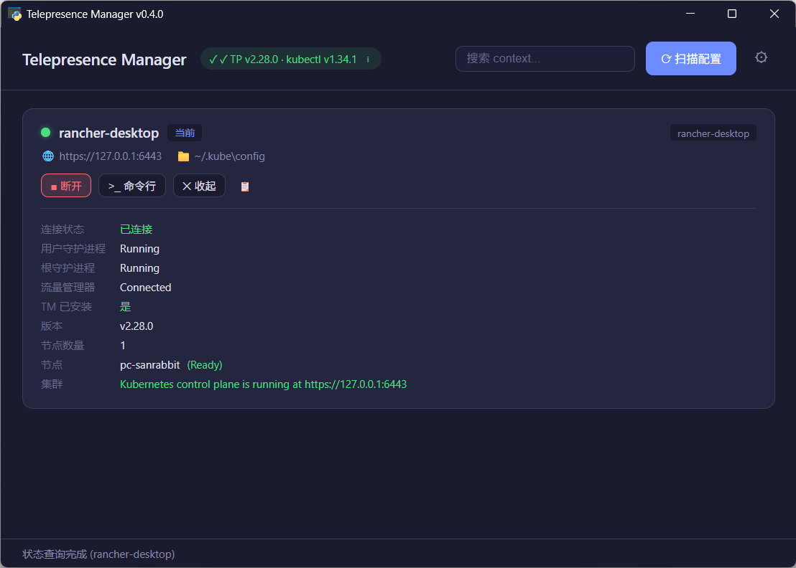

# Telepresence Manager

Windows 桌面 GUI 工具，用于管理 [Telepresence](https://www.telepresence.io/) 连接。基于 Python + pywebview (Edge WebView2) 构建。

## 功能

- 🔍 自动扫描 `~/.kube/` 下的 K8s 配置文件（config、*.txt、*.yaml 等）
- 📋 以卡片列表展示所有 context 信息（名称、集群、Server 地址、来源文件）
- ▶️ 一键连接 / 断开 Telepresence
- 📊 按需查询状态（连接状态、节点数量、Traffic Manager 安装情况）
- 📦 一键安装 / 升级 Traffic Manager
- 💻 以指定 context 打开命令行窗口
- 🔧 自动检测 telepresence 和 kubectl 安装状态，显示版本和路径
- 🔎 按名称、集群、服务器、来源文件搜索过滤 context
- 🔄 连接状态每 30 秒自动刷新
- 🔔 所有操作弹出 Toast 通知
- ⚠️ 断开连接前确认对话框，防止误操作
- 📋 一键复制 context 名称到剪贴板
- ⌨️ 键盘快捷键（`Ctrl+R` 扫描、`Esc` 关闭、`Ctrl+F` 搜索）
- 🆕 启动时自动检查更新，一键更新并自动重启

## 截图



## 前置依赖

- Windows 10/11
- [telepresence](https://www.telepresence.io/) v2.x
- [kubectl](https://kubernetes.io/docs/tasks/tools/)
- Edge WebView2 Runtime（Windows 10/11 自带）

## 安装

### 下载使用（推荐）

从 [GitHub Releases](https://github.com/hueidou/telepresence-manager/releases) 下载最新版本：

| 产物 | 说明 |
|------|------|
| `TelepresenceManager.exe` | 独立可执行文件，双击即可运行 |
| `TelepresenceManager-*-portable.zip` | 便携版，解压后运行 |
| `TelepresenceManager-*-Setup.exe` | Windows 安装程序，带开始菜单快捷方式 |

### 从源码运行

```bash
git clone https://github.com/hueidou/telepresence-manager.git
cd telepresence-manager
pip install -r requirements.txt
python main.py
```

### 本地构建

```bash
pip install pyinstaller
python scripts/build.py
```

可执行文件将生成在 `dist/` 目录下。

## 项目结构

```
telepresence-manager/
├── main.py                      # 入口，创建 pywebview 窗口
├── VERSION                      # 版本号
├── requirements.txt             # Python 依赖
├── telepresence_manager.spec    # PyInstaller 构建配置
├── LICENSE                      # MIT License
├── README.md                    # 英文文档
├── README.zh.md                 # 本文档
├── app/                         # Python 后端
│   ├── __init__.py
│   ├── api.py                   # pywebview JS API 桥接层
│   ├── kubeconfig.py            # Kubeconfig 文件发现与解析
│   ├── telepresence.py          # Telepresence / kubectl CLI 封装
│   └── updater.py               # 版本检查与自动更新
├── web/                         # 前端 UI
│   ├── index.html               # 页面结构
│   ├── style.css                # 暗色主题样式
│   └── app.js                   # 前端逻辑
├── scripts/
│   └── build.py                 # 构建脚本
├── installer/
│   └── setup.iss                # Inno Setup 安装程序脚本
└── .github/workflows/
    └── release.yml              # CI/CD：自动构建与发布
```

## 工作原理

```
Edge WebView2 窗口 (web/)
    ↕  pywebview JS API 桥接
Python 后端 (app/api.py)
    ├─ kubeconfig.py    扫描 ~/.kube/，解析 YAML 配置
    ├─ telepresence.py  封装 telepresence / kubectl 子进程调用
    └─ updater.py       检查 GitHub Releases 获取更新
```

- 后端通过 `subprocess` 调用 `telepresence` 和 `kubectl` CLI
- 所有长时间操作在后台线程执行，不阻塞 UI
- 工具路径自动搜索，不依赖 PATH 环境变量
- 支持多文档 YAML、txt 文件等多种配置格式
- 自动更新通过下载新 exe 并由批处理脚本完成替换重启

## 支持的配置格式

| 格式 | 示例文件 |
|------|---------|
| 标准 kubeconfig | `~/.kube/config` |
| 文本文件 | `~/.kube/work.txt` |
| YAML 文件 | `~/.kube/cluster.yaml` |
| 多文档 YAML | 包含 `---` 分隔的多个配置 |

工具会自动识别有效配置：检查文件是否包含 `kind: Config`、`clusters`、`contexts` 等关键字段。

## License

[MIT](LICENSE)
